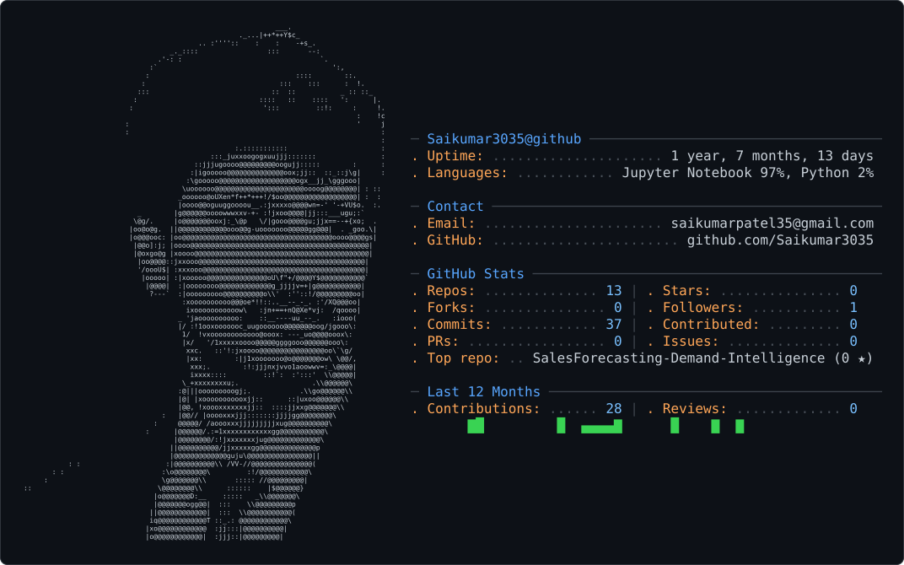

<div align="center">  <a href="https://github.com/Saikumar3035">  </a> <br/>     </div> <br/>

I build the layer between raw data and a decision someone can act on — forecasting models, log-monitoring pipelines, and transformer-based NLP systems. B.Tech in Data Science from KU College of Engineering & Technology, Warangal, with internships in Python full-stack development at Infosys and generative AI at DataTeach.AI, plus a summer research stint at IIT Guwahati. Based in Warangal, Telangana, and currently looking for data analysis / ML engineering roles.

---

<p align="center">
  
</p>

---

## `01` · PROFILE

<table>
<tr>
<td width="55%" valign="top">

### About Me

I'm a **Data Science graduate focused on Artificial Intelligence, Machine Learning, NLP and Python development**.

I enjoy turning real-world problems into practical data and AI solutions — from experimentation and model development to usable applications.

- 🎓 **B.Tech — Data Science**
- 🤖 **AI / Machine Learning**
- 🐍 **Python Development**
- 🧠 **NLP & Generative AI**
- 📊 **Data Analytics**
- 🌐 **Full-Stack Development**

</td>

<td width="45%" valign="top">

### Current Focus

```text
AI / ML
████████████████░░  80%

NLP
███████████████░░░  75%

Data Analytics
████████████████░░  80%

Python
█████████████████░  85%

Full Stack
███████████░░░░░░░  60%
```

</td>
</tr>
</table>

---

## `02` · TECHNICAL STACK

### Programming

<p>


</p>

### AI / Machine Learning

<p>


</p>

### Data Science & Analytics

<p>


</p>

### Web & Backend

<p>


</p>

### Tools & Platforms

<p>


</p>

---

## `03` · AI & DATA FOCUS

<table>
<tr>
<td align="center" width="20%">

### 🤖
**Machine Learning**

</td>
<td align="center" width="20%">

### 🧠
**Generative AI**

</td>
<td align="center" width="20%">

### 🔎
**RAG / LLMs**

</td>
<td align="center" width="20%">

### 🌐
**NLP**

</td>
<td align="center" width="20%">

### 📊
**Analytics**

</td>
</tr>
</table>

```text
                    REAL-WORLD PROBLEM
                            │
                            ▼
                     ┌─────────────┐
                     │     DATA    │
                     └──────┬──────┘
                            │
              ┌─────────────┼─────────────┐
              ▼             ▼             ▼
           ANALYSIS         ML            NLP
              │             │             │
              └─────────────┼─────────────┘
                            ▼
                     ┌─────────────┐
                     │ AI SYSTEM   │
                     └──────┬──────┘
                            │
                            ▼
                       USEFUL OUTPUT
```

---

## `04` · GITHUB ACTIVITY

<div align="center">


</div>

<br>

<div align="center">


</div>

> GitHub activity is intentionally limited to lightweight statistics here. No external activity graph or trophy widget is required.

---

## `05` · DEVELOPMENT PHILOSOPHY

<div align="center">

```text
        LEARN
          │
          ▼
        BUILD
          │
          ▼
       EXPERIMENT
          │
          ▼
        DEBUG
          │
          ▼
      UNDERSTAND
          │
          ▼
        IMPROVE
          │
          ▼
         SHIP
```

</div>

> **Learn by building. Understand by experimenting. Improve by shipping.**

---

## `06` · CONNECT

<div align="center">

<a href="mailto:saikumarpatel35@gmail.com">

</a>

<a href="https://www.linkedin.com/in/saikumarmudam/">

</a>

<a href="https://github.com/Saikumar3035">

</a>

<a href="https://www.youtube.com/@saitechverse">

</a>

<a href="https://leetcode.com/u/mudamsaikumar/">

</a>

<a href="https://www.kaggle.com/saikumarmudam">

</a>

</div>

---

# `07` · PROJECTS

> Selected work focused on **AI, Data Science, NLP and practical software systems.**

### 💧 AquaVision — Water Quality Predictor

Machine-learning application for predicting water-quality parameters using ensemble regression.

**Stack**

`Python` `Scikit-Learn` `Random Forest` `MultiOutputRegressor` `Streamlit` `Joblib`

---

### 🔎 Digital Media Verification Toolkit

Python-based toolkit for analyzing and verifying potentially misleading digital media and information.

**Stack**

`Python` `OpenCV` `PIL` `ImageHash` `Fuzzy Matching` `NewsAPI` `Tkinter`

---

### 🧠 Telugu AI / NLP Suite

Exploration of AI capabilities for Telugu language processing, including speech recognition, translation, slang detection and sentiment analysis.

**Stack**

`Python` `Transformers` `Whisper` `XLM-R` `mT5` `Streamlit`

---

### 📊 High-Throughput Log Analytics & Monitoring Engine

Data-processing and monitoring system designed to process large log streams, detect anomalies and visualize operational metrics.

**Stack**

`Python` `Dask` `Pandas` `Z-Score` `Streamlit` `Plotly` `SMTP`

---

### 📍 Real-Time GPS / Vehicle Tracker

Web-based GPS tracking system exploring browser geolocation, real-time location sharing and interactive maps.

**Stack**

`JavaScript` `Node.js` `Express` `GPS` `Maps` `Cloudflare Tunnel`

---

### ✈️ Aircraft Squawk Reporting System

Full-stack aircraft squawk reporting and tracking application designed around real-time reporting workflows.

**Stack**

`React` `Node.js` `Express` `MongoDB`

---

## `08` · MORE ON GITHUB

<div align="center">

<a href="https://github.com/Saikumar3035?tab=repositories">

</a>

</div>

<br>

<div align="center">

### Building with data. Experimenting with AI. Learning continuously.

</div>
